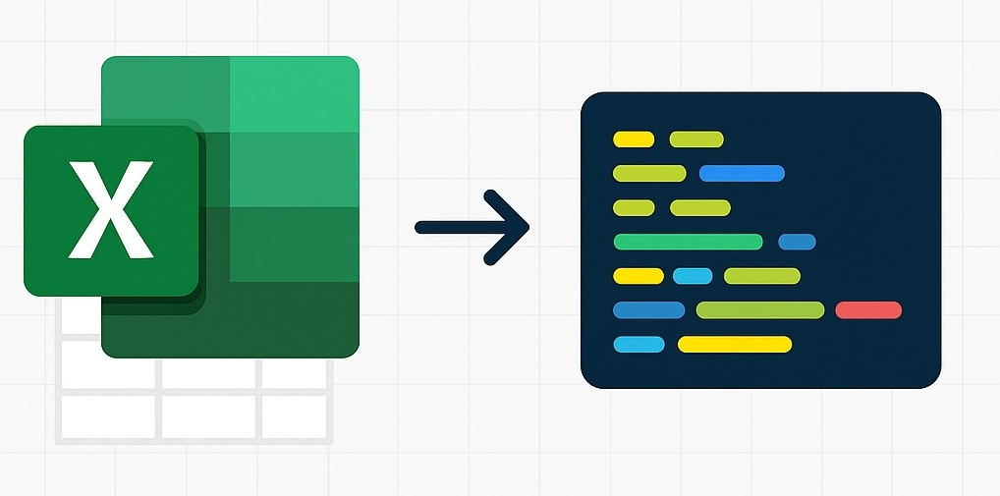
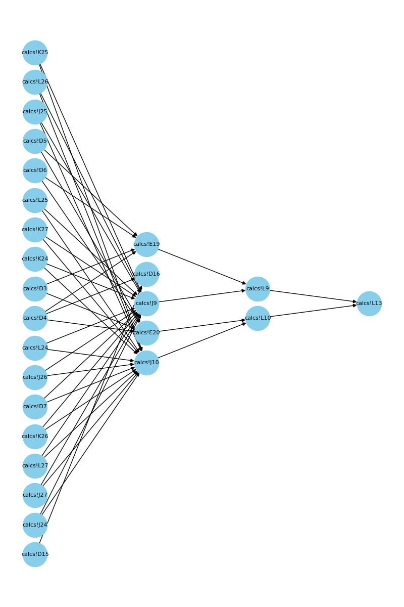

# Excel Agents
### Automate Excel→Python code extraction using LLM agents



## Introduction
I started this project to expeirment with a multi-agent workflow that parses information in different cells and uses multiple LLM API calls in proper sequence to convert an engineering calculation Excel spreadsheet into well-documented Python codebase. 


The codebase is a combination of rule-based logic to extract data and computational graph dependencies between cells and LLM intelligence to undrstand variables, give them names and eventually write code and documentation. The figure below provides a high level overview of this proejct (generated by [DeepWiki](https://deepwiki.org/)). 


## ⚠️ Important Notice
Using LLM agents with API calls will incur costs. The example provided in this documentation cost me less than $0.50 USD, using a mix of OpenAI's GPT-4o and GPT-4o-mini in 2025.
In the future, I plan to add a cost estimator to help users better understand the approximate API usage before dispatching agents. 
Please be mindful of potential costs, especially when testing this codebase with large or custom spreadsheets. More details about API pricing and usage are provided in the next section of this documentation.

## 1. Setup
To run this repo locally, you will need to follow these steps:
- Install [MongoDB Community Server](https://www.mongodb.com/try/download/community) (free)
- Create a virtual Python environment, cd to the project repository and run `pip install -r requirements.txt`
- [OpenAI](https://openai.com/api/) API key
- [LangFuse](https://langfuse.com/) API key (optional and free for limited use)
- Ensure MongoDB is running locally. Try running `mongosh` in the terminal. If you see the server ID, that means the server is running
- Open `.env.example` and add proper credentials for LangFuse and OpenAI APIs. Remove the .example extension after updating the contents of the file

### 1.1. Project Structure
Generated by [gitingest ❤️](https://gitingest.com/)
```
└── omidsaj-excel_agent/
    ├── README.md
    ├── example.ipynb
    ├── LICENSE
    ├── requirements.txt
    ├── .cursorignore
    ├── .env.example
    ├── db/
    │   ├── __init__.py
    │   ├── database.py
    │   ├── excel_manager.py
    │   └── models.py
    ├── examples/
    │   └── simple_beam/
    │       ├── README.md
    │       ├── example.py
    │       ├── simple_beam.xlsx
    │       ├── variable_db_simple_beam.pkl
    │       ├── ~$simple_beam.xlsx
    │       └── beam_design/
    │           └── calculations.py
    ├── llm_agents/
    │   ├── cell_inspectors.py
    │   └── programmer.py
    ├── parsers/
    │   ├── __init__.py
    │   ├── excel_parser.py
    │   ├── experiments.ipynb
    │   └── formula_parser.py
    ├── prompts/
    │   ├── cell_inspector.yaml
    │   └── programmer.yaml
    └── utils/
        ├── excel.py
        └── graph.py
```

The main components of this project are:
- **`db/`**: Database models and Excel management utilities
- **`llm_agents/`**: Core agent classes for cell inspection and code generation
- **`parsers/`**: Excel and formula parsing utilities
- **`prompts/`**: YAML configuration files for system prompts
- **`utils/`**: Helper utilities for Excel operations and graph visualization
- **`examples/`**: Sample spreadsheets and generated code outputs


## 2. Getting Started
In what follows, an overview of this agentic workflow is provided. You may also refer to [this notebook](https://github.com/OmidSaj/excel_agent/blob/main/example.ipynb) to reproduce the results for an example spreadsheet. 

### 2.1. Define a Spreadsheet
Start by specifying the path to your Excel spreadsheet as follows. The AI-generated content will be stored in the same directory. You can also use the following default example in the repo:
```python
spreadsheet_name = 'simple_beam'
path = f"examples/simple_beam/{spreadsheet_name}.xlsx"
```

There are two main classes that allow us to orchestrate the agentic workflow:
1. `ExcelVariableAgent`: This class will preprocess an existing Excel spreadsheet, create a database, and dispatch a swarm of agents to study the contents of cells, create variable names for our Python script, and make small Python code blocks for the contents of cells.

2. `ProgrammerAgent`: Once the ExcelVariableAgent workers have finished creating a processed database of cell information, the Programmer will start refactoring the Python code blocks, scaffolding a Python codebase, and finally creating an example script to test the codebase.

### 2.2. ExcelVariableAgent
Create an instance of the variable agent. Running the following cell will start extracting useful information from each cell, including the content, formulas, dependents, and more.

```python
from llm_agents.cell_inspectors import ExcelVariableAgent

variable_agent.graph.visualize(
    figsize=(8, 12),
    node_size=1200,
    title=spreadsheet_name,
    save_path=f"{variable_agent.project_dir}/computegraph_{spreadsheet_name}.png"
)
```

The `variable_agent` will create a computational graph and start processing cells from input root nodes to the output leaf nodes as shown in the following graph:



Now, with all the preprocessing out of the way, we can dispatch the army of LLMs to start inspecting cells. For each layer, we call all nodes simultaneously using the async functionality in Python.

💸⚠️ Note that running the following cell will cost you money. There will be an API call for every node of your compute graph. If you don't want to make API calls, you can skip running the following cell as the programmer agent will load `variable_db_simple_beam.pkl` for this specific example from the project directory.

```python
await variable_agent.orchestrate_variable_extraction()
```

### 2.3. ProgrammerAgent
While we created some code blocks for the contents of each cell in the previous part, the code blocks are not connected to form a complete and end-to-end graph. We collect the previous code blocks and present them to an object of the `ProgrammerAgent` to generate a higher quality codebase for us.

```python 
from llm_agents.programmer import ProgrammerAgent

programmer = ProgrammerAgent(
    spread_sheet_path=path,
    openai_model="gpt-4.1",
    trace_with_langfuse=True
)
```

After initialization, we can run our agent to create our codebase. The `ProgrammerAgent` can create directories and save code as .py files.

💸⚠️ Running the following cell will also cost you money. Feel free to skip it and directly go to the spreadsheet directory to look at the AI-generated content.

```python
messages = await programmer.initialize_coding_agent()
```

### 2.4. Test the Final Results
Go to the spreadsheet project directory and review the code! You will see that our LLM even created a README file to document the project. Additionally, you can run the example.py generated by the LLM to test how it performed. For this specific example, it is recommended to use a larger top-tier LLM with better reasoning capabilities.

## 3. Libraries Used
This project leverages several powerful Python libraries to handle different aspects of the Excel-to-Python conversion process:

- **Excel Processing**:
  - `openpyxl`: For reading and parsing Excel files
  - `formulas`: For parsing Excel formulas and their dependencies
  - `pandas`: For data manipulation and analysis

- **AI and LLM Integration**:
  - `langchain`